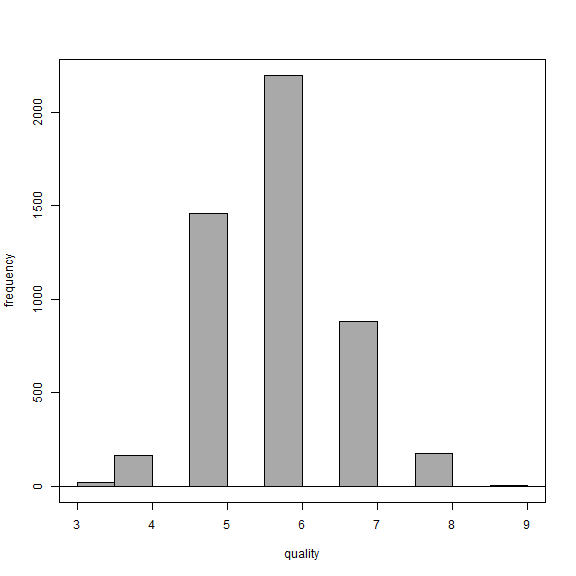
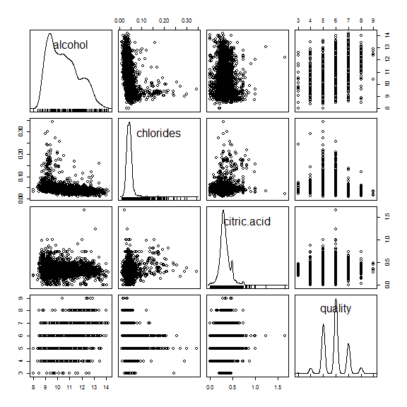
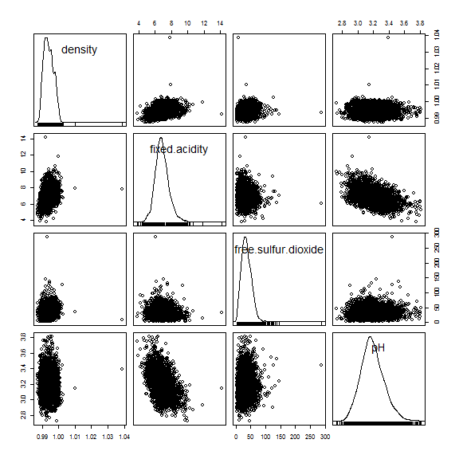
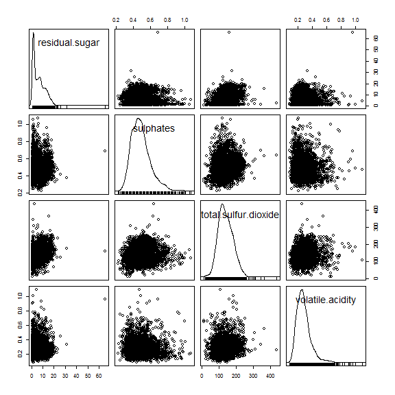
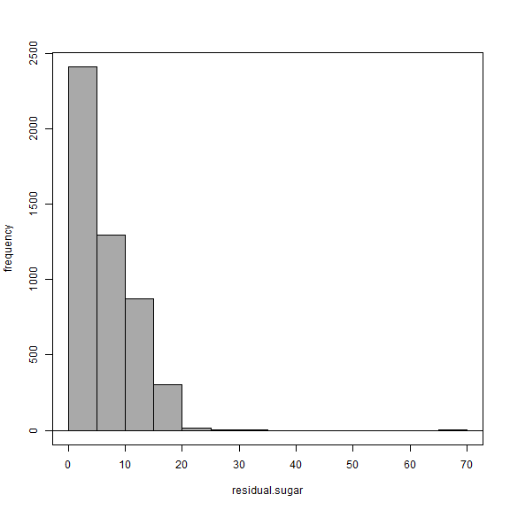
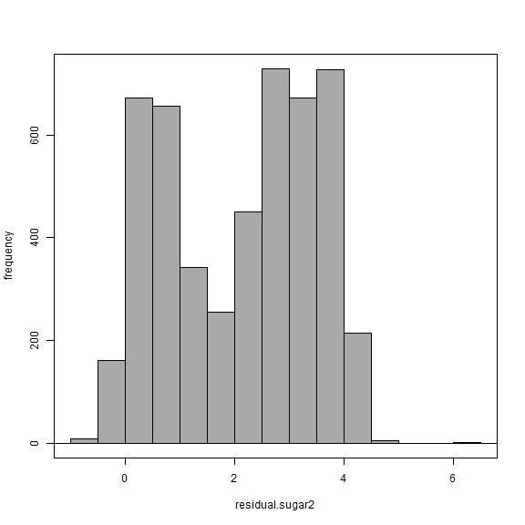
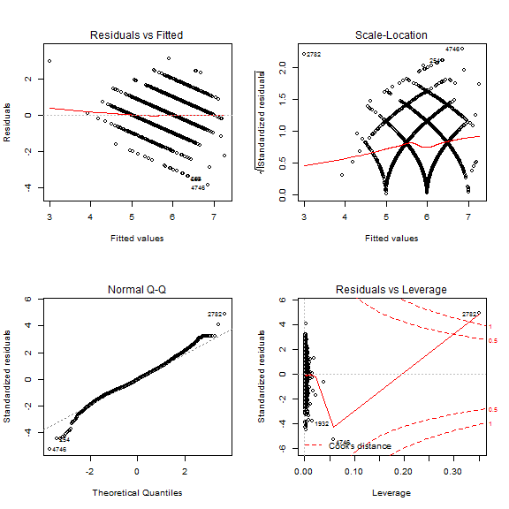

<!-- R Commander Markdown Template -->

Homework #3
=======================

### Taylor Thul

### 2017-02-14


Get the dataset into R.


```r
> names(White_wines) <- make.names(names(White_wines))
```


```r
> library(abind, pos=18)
```


```r
> library(e1071, pos=19)
```

Run some summary statistics: 


```r
> numSummary(White_wines[,c("alcohol", "chlorides", "citric.acid", "density", 
+   "fixed.acidity", "free.sulfur.dioxide", "pH", "quality", "residual.sugar", 
+   "sulphates", "total.sulfur.dioxide", "volatile.acidity")], 
+   statistics=c("mean", "sd", "IQR", "quantiles"), quantiles=c(0,.25,.5,.75,1))
```

```
                             mean           sd        IQR      0%
alcohol               10.51426705  1.230620568  1.9000000 8.00000
chlorides              0.04577236  0.021847968  0.0140000 0.00900
citric.acid            0.33419151  0.121019804  0.1200000 0.00000
density                0.99402738  0.002990907  0.0043775 0.98711
fixed.acidity          6.85478767  0.843868228  1.0000000 3.80000
free.sulfur.dioxide   35.30808493 17.007137325 23.0000000 2.00000
pH                     3.18826664  0.151000600  0.1900000 2.72000
quality                5.87790935  0.885638575  1.0000000 3.00000
residual.sugar         6.39141486  5.072057784  8.2000000 0.60000
sulphates              0.48984688  0.114125834  0.1400000 0.22000
total.sulfur.dioxide 138.36065741 42.498064554 59.0000000 9.00000
volatile.acidity       0.27824112  0.100794548  0.1100000 0.08000
                             25%       50%      75%      100%    n
alcohol                9.5000000  10.40000  11.4000  14.20000 4898
chlorides              0.0360000   0.04300   0.0500   0.34600 4898
citric.acid            0.2700000   0.32000   0.3900   1.66000 4898
density                0.9917225   0.99374   0.9961   1.03898 4898
fixed.acidity          6.3000000   6.80000   7.3000  14.20000 4898
free.sulfur.dioxide   23.0000000  34.00000  46.0000 289.00000 4898
pH                     3.0900000   3.18000   3.2800   3.82000 4898
quality                5.0000000   6.00000   6.0000   9.00000 4898
residual.sugar         1.7000000   5.20000   9.9000  65.80000 4898
sulphates              0.4100000   0.47000   0.5500   1.08000 4898
total.sulfur.dioxide 108.0000000 134.00000 167.0000 440.00000 4898
volatile.acidity       0.2100000   0.26000   0.3200   1.10000 4898
```
Make sure no data is missing:


```r
> sapply(White_wines, function(x)(sum(is.na(x)))) # NA counts
```

```
       fixed.acidity     volatile.acidity          citric.acid 
                   0                    0                    0 
      residual.sugar            chlorides  free.sulfur.dioxide 
                   0                    0                    0 
total.sulfur.dioxide              density                   pH 
                   0                    0                    0 
           sulphates              alcohol              quality 
                   0                    0                    0 
     residual.sugar2                group 
                   0                    0 
```
No missing data! Hooray!
Look at the distribution of the variables:


```r
> #appears normal
> with(White_wines, Hist(quality, scale="frequency", breaks="Sturges", 
+   col="darkgray"))
```



Scatterplot matric of alcohol, chlorides, citric acid and quality

```r
> scatterplotMatrix(~alcohol+chlorides+citric.acid+quality, reg.line=FALSE, 
+   smooth=FALSE, spread=FALSE, span=0.5, ellipse=FALSE, levels=c(.5, .9), 
+   id.n=0, diagonal = 'density', data=White_wines)
```



Scatterplot of density, fixed acidity, free sulfur dioxide and pH


```r
> scatterplotMatrix(~density+fixed.acidity+free.sulfur.dioxide+pH, 
+   reg.line=FALSE, smooth=FALSE, spread=FALSE, span=0.5, ellipse=FALSE, 
+   levels=c(.5, .9), id.n=0, diagonal = 'density', data=White_wines)
```



Scatterplot of residual sugar, sulphates, total sulfur dioxide and volatile acidity.  Residual sugar may need transformed. 


```r
> scatterplotMatrix(~residual.sugar+sulphates+total.sulfur.dioxide+volatile.acidity,
+    reg.line=FALSE, smooth=FALSE, spread=FALSE, span=0.5, ellipse=FALSE, 
+   levels=c(.5, .9), id.n=0, diagonal = 'density', data=White_wines)
```


look at residual sugar on it's own


```r
> with(White_wines, Hist(residual.sugar, scale="frequency", breaks="Sturges", 
+   col="darkgray"))
```


add new variable of log of sugar residuals

```r
> White_wines$residual.sugar2 <- with(White_wines, log2(residual.sugar))
```
it doesn't really look more normal 


```r
> with(White_wines, Hist(residual.sugar2, scale="frequency", breaks="Sturges",
+    col="darkgray"))
```




```r
> library(nortest, pos=20)
```


```r
> with(White_wines, shapiro.test(residual.sugar))
```

```

	Shapiro-Wilk normality test

data:  residual.sugar
W = 0.88457, p-value < 2.2e-16
```
the Shapiro-Wilk is < 0.05 so we accept the hypothesis the data is not normally distibuted.
so try the Shapiro- Wilk on the transformed data 


```r
> with(White_wines, shapiro.test(residual.sugar2))
```

```

	Shapiro-Wilk normality test

data:  residual.sugar2
W = 0.9306, p-value < 2.2e-16
```
this did not help at all... still not normal.
moving on to the regression model


....but I don't know what to do about that so moving on the the regression

```r
> # divide the dataset into a training and a testing set based on a random uniform number on fixed seed, which in this case we are using the date
> # this step is also creating a new variable and adding it to the data set which is a distribution of random numbers from 0 to 1 
> 
> set.seed(20170214)
> White_wines$group <- runif(length(White_wines$quality), min = 0, max = 1)
> summary(White_wines)
```

```
 fixed.acidity    volatile.acidity  citric.acid     residual.sugar  
 Min.   : 3.800   Min.   :0.0800   Min.   :0.0000   Min.   : 0.600  
 1st Qu.: 6.300   1st Qu.:0.2100   1st Qu.:0.2700   1st Qu.: 1.700  
 Median : 6.800   Median :0.2600   Median :0.3200   Median : 5.200  
 Mean   : 6.855   Mean   :0.2782   Mean   :0.3342   Mean   : 6.391  
 3rd Qu.: 7.300   3rd Qu.:0.3200   3rd Qu.:0.3900   3rd Qu.: 9.900  
 Max.   :14.200   Max.   :1.1000   Max.   :1.6600   Max.   :65.800  
   chlorides       free.sulfur.dioxide total.sulfur.dioxide
 Min.   :0.00900   Min.   :  2.00      Min.   :  9.0       
 1st Qu.:0.03600   1st Qu.: 23.00      1st Qu.:108.0       
 Median :0.04300   Median : 34.00      Median :134.0       
 Mean   :0.04577   Mean   : 35.31      Mean   :138.4       
 3rd Qu.:0.05000   3rd Qu.: 46.00      3rd Qu.:167.0       
 Max.   :0.34600   Max.   :289.00      Max.   :440.0       
    density             pH          sulphates         alcohol     
 Min.   :0.9871   Min.   :2.720   Min.   :0.2200   Min.   : 8.00  
 1st Qu.:0.9917   1st Qu.:3.090   1st Qu.:0.4100   1st Qu.: 9.50  
 Median :0.9937   Median :3.180   Median :0.4700   Median :10.40  
 Mean   :0.9940   Mean   :3.188   Mean   :0.4898   Mean   :10.51  
 3rd Qu.:0.9961   3rd Qu.:3.280   3rd Qu.:0.5500   3rd Qu.:11.40  
 Max.   :1.0390   Max.   :3.820   Max.   :1.0800   Max.   :14.20  
    quality      residual.sugar2       group          
 Min.   :3.000   Min.   :-0.7370   Min.   :0.0002833  
 1st Qu.:5.000   1st Qu.: 0.7655   1st Qu.:0.2537537  
 Median :6.000   Median : 2.3785   Median :0.5034640  
 Mean   :5.878   Mean   : 2.1365   Mean   :0.5033795  
 3rd Qu.:6.000   3rd Qu.: 3.3074   3rd Qu.:0.7564856  
 Max.   :9.000   Max.   : 6.0400   Max.   :0.9993326  
```

```r
> #what random forests do is this process over and over again and makes the aggregate which might be called bootstrapping?
> 
> White_wines.train <- subset(White_wines, group <= 0.90)
> White_wines.test <- subset(White_wines, group > 0.90)
> 
> #see if it worked
> summary(White_wines.train)
```

```
 fixed.acidity    volatile.acidity  citric.acid     residual.sugar  
 Min.   : 3.800   Min.   :0.0800   Min.   :0.0000   Min.   : 0.600  
 1st Qu.: 6.300   1st Qu.:0.2100   1st Qu.:0.2700   1st Qu.: 1.700  
 Median : 6.800   Median :0.2600   Median :0.3200   Median : 5.100  
 Mean   : 6.851   Mean   :0.2784   Mean   :0.3337   Mean   : 6.342  
 3rd Qu.: 7.300   3rd Qu.:0.3200   3rd Qu.:0.3900   3rd Qu.: 9.800  
 Max.   :14.200   Max.   :1.1000   Max.   :1.6600   Max.   :65.800  
   chlorides       free.sulfur.dioxide total.sulfur.dioxide
 Min.   :0.00900   Min.   :  3.00      Min.   :  9.0       
 1st Qu.:0.03600   1st Qu.: 23.00      1st Qu.:108.0       
 Median :0.04300   Median : 34.00      Median :134.0       
 Mean   :0.04574   Mean   : 35.28      Mean   :138.3       
 3rd Qu.:0.05000   3rd Qu.: 46.00      3rd Qu.:167.0       
 Max.   :0.34600   Max.   :289.00      Max.   :440.0       
    density             pH         sulphates         alcohol     
 Min.   :0.9871   Min.   :2.72   Min.   :0.2200   Min.   : 8.00  
 1st Qu.:0.9917   1st Qu.:3.09   1st Qu.:0.4100   1st Qu.: 9.50  
 Median :0.9937   Median :3.18   Median :0.4700   Median :10.40  
 Mean   :0.9940   Mean   :3.19   Mean   :0.4892   Mean   :10.52  
 3rd Qu.:0.9960   3rd Qu.:3.28   3rd Qu.:0.5500   3rd Qu.:11.40  
 Max.   :1.0390   Max.   :3.82   Max.   :1.0800   Max.   :14.20  
    quality      residual.sugar2       group          
 Min.   :3.000   Min.   :-0.7370   Min.   :0.0002833  
 1st Qu.:5.000   1st Qu.: 0.7655   1st Qu.:0.2285282  
 Median :6.000   Median : 2.3505   Median :0.4596618  
 Mean   :5.879   Mean   : 2.1201   Mean   :0.4570277  
 3rd Qu.:6.000   3rd Qu.: 3.2928   3rd Qu.:0.6859608  
 Max.   :9.000   Max.   : 6.0400   Max.   :0.8998507  
```

```r
> #I think it worked! 
```
```

moving on to do a regression:


```r
> RegModel.1 <- 
+   lm(quality~alcohol+chlorides+citric.acid+density+fixed.acidity+free.sulfur.dioxide+pH+residual.sugar+sulphates+total.sulfur.dioxide+volatile.acidity,
+    data=White_wines.train)
> summary(RegModel.1)
```

```

Call:
lm(formula = quality ~ alcohol + chlorides + citric.acid + density + 
    fixed.acidity + free.sulfur.dioxide + pH + residual.sugar + 
    sulphates + total.sulfur.dioxide + volatile.acidity, data = White_wines.train)

Residuals:
    Min      1Q  Median      3Q     Max 
-3.8642 -0.4973 -0.0362  0.4704  3.0782 

Coefficients:
                       Estimate Std. Error t value Pr(>|t|)    
(Intercept)           1.552e+02  1.937e+01   8.013 1.42e-15 ***
alcohol               1.885e-01  2.510e-02   7.510 7.10e-14 ***
chlorides            -2.444e-01  5.701e-01  -0.429 0.668114    
citric.acid           4.294e-02  1.010e-01   0.425 0.670887    
density              -1.555e+02  1.965e+01  -7.917 3.06e-15 ***
fixed.acidity         8.103e-02  2.176e-02   3.724 0.000199 ***
free.sulfur.dioxide   4.064e-03  8.870e-04   4.581 4.74e-06 ***
pH                    7.268e-01  1.099e-01   6.614 4.19e-11 ***
residual.sugar        8.492e-02  7.816e-03  10.865  < 2e-16 ***
sulphates             6.578e-01  1.068e-01   6.156 8.10e-10 ***
total.sulfur.dioxide -4.434e-04  3.963e-04  -1.119 0.263311    
volatile.acidity     -1.822e+00  1.199e-01 -15.199  < 2e-16 ***
---
Signif. codes:  0 '***' 0.001 '**' 0.01 '*' 0.05 '.' 0.1 ' ' 1

Residual standard error: 0.7538 on 4426 degrees of freedom
Multiple R-squared:  0.2805,	Adjusted R-squared:  0.2787 
F-statistic: 156.9 on 11 and 4426 DF,  p-value: < 2.2e-16
```
So it looks like alcohol, chlorides, density, fixed acidity, pH, residual. sugar, sulphates, and volatile acidity are all singificanly assoicated with predicting quality.  
Run the model again taking out the non-signficant variables:


```r
> RegModel.2 <- 
+   lm(quality~alcohol+density+fixed.acidity+free.sulfur.dioxide+pH+residual.sugar+sulphates++volatile.acidity,
+    data=White_wines.train)
> summary(RegModel.2)
```

```

Call:
lm(formula = quality ~ alcohol + density + fixed.acidity + free.sulfur.dioxide + 
    pH + residual.sugar + sulphates + +volatile.acidity, data = White_wines.train)

Residuals:
    Min      1Q  Median      3Q     Max 
-3.8536 -0.4930 -0.0388  0.4675  3.0889 

Coefficients:
                      Estimate Std. Error t value Pr(>|t|)    
(Intercept)          1.598e+02  1.872e+01   8.535  < 2e-16 ***
alcohol              1.888e-01  2.495e-02   7.566 4.64e-14 ***
density             -1.603e+02  1.898e+01  -8.445  < 2e-16 ***
fixed.acidity        8.386e-02  2.133e-02   3.931 8.58e-05 ***
free.sulfur.dioxide  3.487e-03  7.137e-04   4.885 1.07e-06 ***
pH                   7.325e-01  1.078e-01   6.792 1.25e-11 ***
residual.sugar       8.639e-02  7.594e-03  11.377  < 2e-16 ***
sulphates            6.524e-01  1.064e-01   6.130 9.57e-10 ***
volatile.acidity    -1.861e+00  1.152e-01 -16.150  < 2e-16 ***
---
Signif. codes:  0 '***' 0.001 '**' 0.01 '*' 0.05 '.' 0.1 ' ' 1

Residual standard error: 0.7537 on 4429 degrees of freedom
Multiple R-squared:  0.2802,	Adjusted R-squared:  0.2789 
F-statistic: 215.5 on 8 and 4429 DF,  p-value: < 2.2e-16
```
Check some plots to see how the model fits:

```r
> layout(matrix(1:4,2,2))
> plot(RegModel.2)
```




